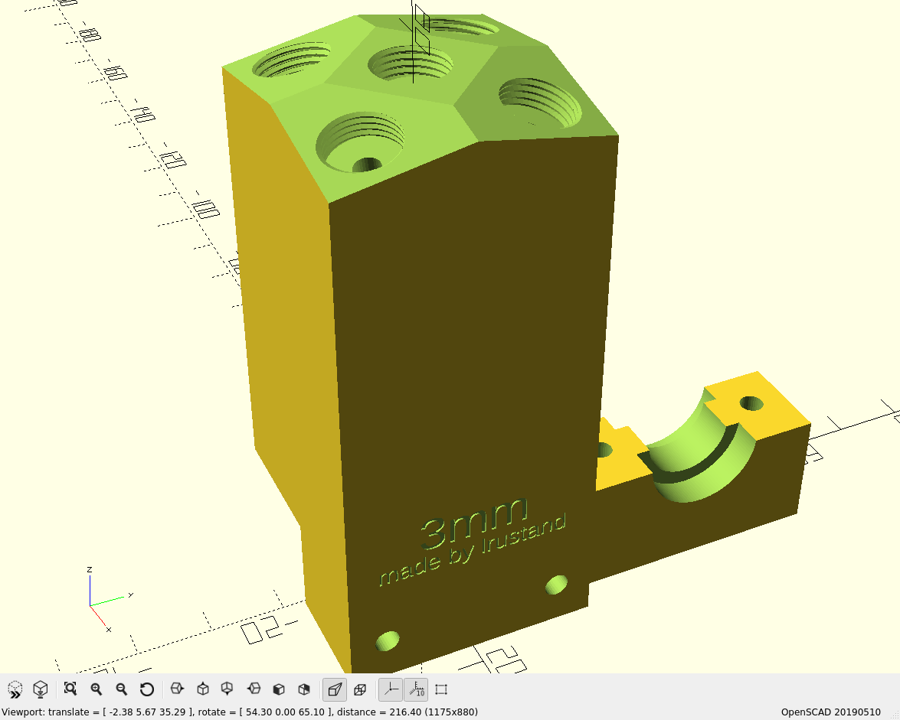
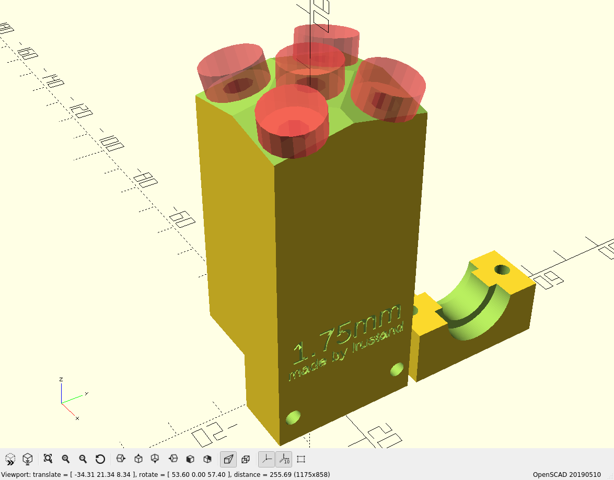
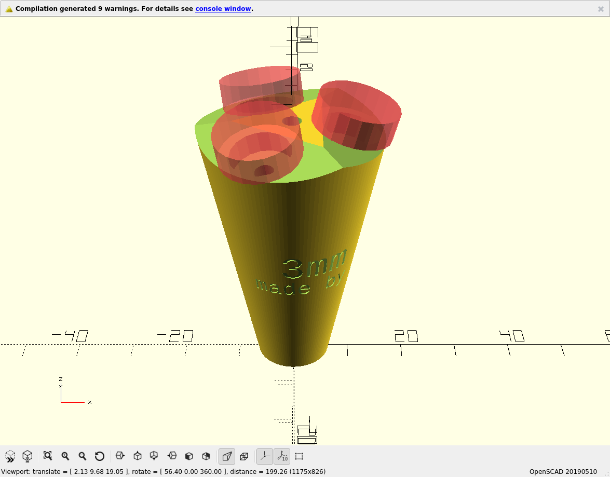
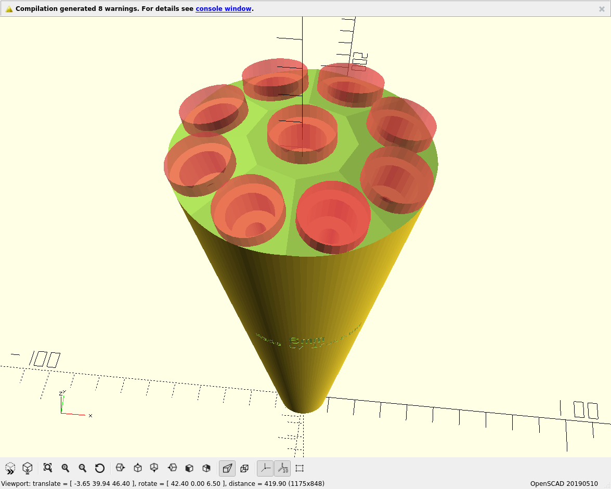

# Parametric Filament Splitter
A parametric filament splitter for 3d printers, allowing you to use multiple extruders and filaments with one hotend. This makes it possible to, for example, print a model with multiple colors without having to pause the print to swap out the filament. This does not however enable color mixing, as the splitter can only accept one filament through at a time.



## Getting started
Before you can generate a filament splitter you need to clone the repository and install some prerequisites first.


### Prerequisites
 - [OpenSCAD](https://github.com/openscad/openscad)
 - [text_on](https://github.com/brodykenrick/text_on_OpenSCAD)
 - [openscad-threads](http://dkprojects.net/openscad-threads/)

#### Installing OpenSCAD
OpenSCAD should be available in the package repository of most distros.

Arch Linux:
```
sudo pacman -S openscad
```

Ubuntu:
```
sudo add-apt-repository ppa:openscad/releases
sudo apt-get update
sudo apt-get install openscad
```

Debian:
```
sudo apt-get install openscad
```

Fedora:
```
sudo dnf -install openscad openscad-MCAD
```

Or you can download the sources and build it yourself:
```
git clone https://github.com/openscad/openscad
```

#### Installing the libraries
 - Download the modules (from [here](https://github.com/brodykenrick/text_on_OpenSCAD) and [here](http://dkprojects.net/openscad-threads/))
 - Put `text_on.scad` and `threads.scad` in the same directory as `splitter.scad`

## Generating a splitter
To generate a splitter, first configure it the way you want it, then render it in OpenSCAD and export it as an STL file ready to be printed.

### Configuration
Configure the filament splitter the way you want it by changing the user variables in `splitter.scad`.
Some of the things you can configure are:
 - Filament diameter
 - Number of filament inputs
 - Bowden connector type
 - Bottom connector type (e3d, bowden or none)

To reduce preview and rendering time you may want to disable the the bowden connector threads until you are ready to render the model for printing. This is because the threads are very computationally heavy to render.

To disable threads set the `threads` variable to false:
```
threads = false;
```

Remember to enable the threads again before rendering the model for printing:
```
threads = true;
```

#### Examples
These examples show how to use some of the most common parameters.

##### 5 in 1, 1.75mm splitter with E3D and PC4-M5
Change the following parameters:
```
filament = 1.75;  // 1.75mm filament
bowden_type = 1;  // Bowden type PC4-M5 (see comment in the source code for what types you can use)
holes = 5;        // 5 filament inputs
bot_conn = "e3d"; // E3D Bottom connector
```

<p align="center">
  
</p>

##### 3 in 1, 3mm splitter with PC6-01 in both ends
Change the following parameters:
```
filament = 3;
bowden_type = 7;
holes = 3;
bot_conn = "bowden";
```

<p align="center">
  
</p>

##### 9 in 1, 6mm splitter with custom bowden dimensions
The parametric nature of the splitter even allows for monstrosities such as this one:
```
filament = 6;      // 6mm filament
bowden_type = 0;   // Manually specify bowden connector dimensions
thread_dia = 14;   // Bowden thread diameter
nut_size = 18;     // Bowden nut size
thread_depth = 10;
holes = 9;         // 9 filament inputs
bot_conn = "bowden";
```

<p align="center">
  
</p>

### Render and export
When you are have configured the splitter the way you want it you can render and export it, but remember to enable the threads first if you disabled them in the earlier steps.

Press F6 to render the model (this might take a little while, so go make yourself some coffee).

When the render finishes you can export it as an STL by pressing F7 and selecting a file name.

## Printing the splitter
The splitter prints easiest when standing up. If you are printing a splitter which has an E3D or bowden connector on the bottom, you will need to enable supports. The threads for the bowden connectors need to be printed with a low layer height. If your slicer allows for variable layer height you can print the rest of the body of the splitter on a higher layer height to save time.

## Hooking up the splitter
> This section is a work in progress

This is how to use the filament splitter once you have generated a model and printed it. There are some required configurations of firmware and/or software for the multi extrusion to work.

To use the splitter you need to have at least two bowden extruders hooked up to your printer, and connect them to the bowden inputs on the splitter. Most printer controller boards only support one or two extruders out of the box, but it is possible to add more extruders by using an expansion board or slave controller.

See the RepRap wiki on [adding more extruders](https://reprap.org/wiki/Adding_more_extruders).

In addition to having the necessary hardware you will also have to have a firmware configuration that supports multiple extruders, and configure your printer to retract the filament far enough to clear the splitter when switching extruders.

See also the article on the [Diamond Hotend](https://reprap.org/wiki/Diamond_Hotend#Slicer_settings) for more information about slicer settings (will need to be adapted a little).
